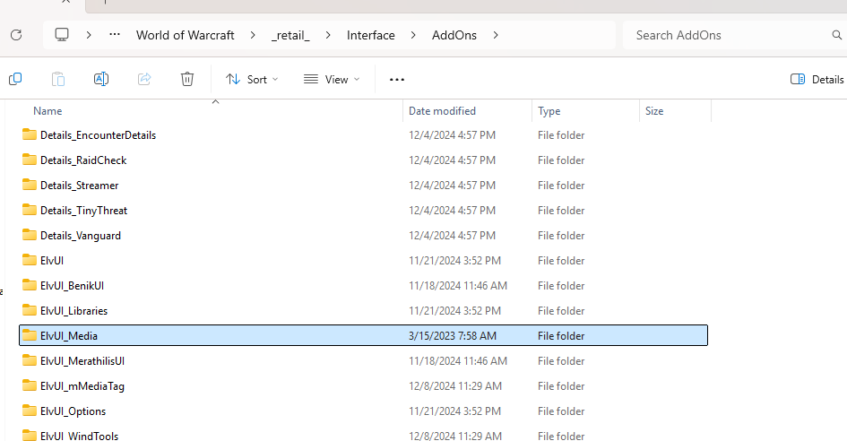

# How to Download my media AddOn from GitHub

Follow these steps to download and install the media files from this repository. This AddOn is used for personal use, and no I do not intend ever to push it to other public platforms:

## Step 1: Download the ZIP File
1. Click the **`<> Code`** button on the repository page.
2. Select **Download ZIP** to download the repository to your computer.

## Step 2: Extract the ZIP File
1. Navigate to the downloaded ZIP file on your computer.
2. Extract the contents of the ZIP file.

## Step 3: Locate the "ElvUI_Media" Folder
1. Inside the extracted ZIP file, find the folder named **`ElvUI_Media`**.

## Step 4: Install in World of Warcraft AddOns Folder
1. Move the **`ElvUI_Media`** folder to your World of Warcraft AddOns directory: World of Warcraft/_retail_/Interface/AddOns
2. Ensure the folder looks like this after install.
  

 
## Additional Notes
- This media package is designed for use with the **ElvUI AddOn**.
- Ensure that ElvUI is installed and updated.
